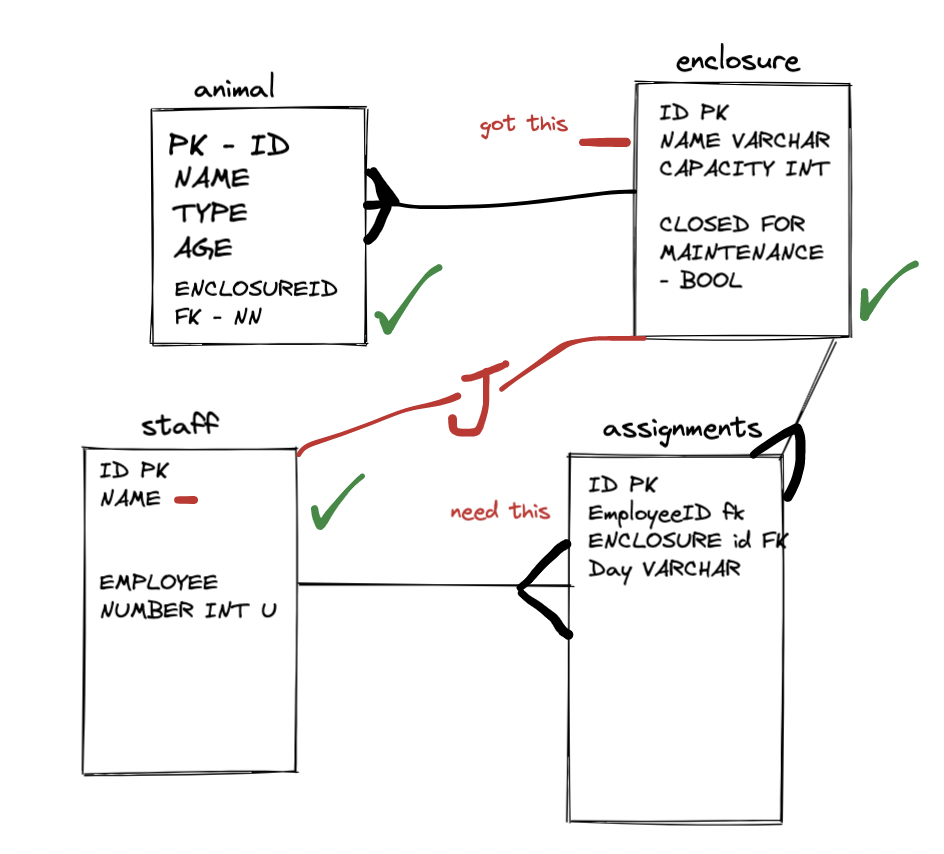

# Safari Park - Tasks

Each of the questions/tasks below can be answered using a `SELECT` query. When you find a solution copy it into the code block under the question before pushing your solution to GitHub.

1) Draw an entity relationship diagram to show the structure of the tables.


2) Set up the tables in a postgres database.

```sql
<!-- Copy solution here -->
CREATE TABLE enclosures(
	id SERIAL PRIMARY KEY,
	name VARCHAR(255),
	capacity INT,
	closed_for_maintenence BOOLEAN
);
CREATE TABLE animals(
	id SERIAL PRIMARY KEY,
	name VARCHAR(255),
	type VARCHAR(255),
	age INT,
	enclosure_id INT REFERENCES enclosures(id)
);
CREATE TABLE staff(
	id SERIAL PRIMARY KEY,
	name VARCHAR(255),
	employee_number VARCHAR(255)
);
CREATE TABLE assignments(
	id SERIAL PRIMARY KEY,
	employee_id INT REFERENCES staff(id),
	enclosure_id INT REFERENCES enclosures(id),
	day VARCHAR(255)
);
```
3) Populate the tables with some of your own data.

```sql
<!-- Copy solution here -->
INSERT INTO enclosures (name, capacity, closed_for_maintenence) VALUES ('Bear Kingdom', 4, FALSE);
INSERT INTO enclosures (name, capacity, closed_for_maintenence) VALUES ('Tiger Jungle', 3, FALSE);
INSERT INTO enclosures (name, capacity, closed_for_maintenence) VALUES ('Aquarium', 20, TRUE);
INSERT INTO enclosures (name, capacity, closed_for_maintenence) VALUES ('Aviary', 10, FALSE);
INSERT INTO enclosures (name, capacity, closed_for_maintenence) VALUES ('Penguin Island', 4, FALSE);

INSERT INTO animals (name, type, age, enclosure_id) VALUES ('Bjorn', 'Bear', 5, 1);
INSERT INTO animals (name, type, age, enclosure_id) VALUES ('Baloo', 'Bear', 7, 1);
INSERT INTO animals (name, type, age, enclosure_id) VALUES ('Rocket', 'Racoon', 1, 1);
INSERT INTO animals (name, type, age, enclosure_id) VALUES ('Po', 'Panda', 11, 1);
INSERT INTO animals (name, type, age, enclosure_id) VALUES ('Tony', 'Tiger', 6, 2);
INSERT INTO animals (name, type, age, enclosure_id) VALUES ('Tigress', 'Tiger', 5, 2);
INSERT INTO animals (name, type, age, enclosure_id) VALUES ('Nemo', 'Clownfish', 1, 3);
INSERT INTO animals (name, type, age, enclosure_id) VALUES ('Squidward', 'Squid', 2, 3);
INSERT INTO animals (name, type, age, enclosure_id) VALUES ('Patrick', 'Starfish', 20, 3);
INSERT INTO animals (name, type, age, enclosure_id) VALUES ('Dominic', 'Cockatiel', 20, 4);
INSERT INTO animals (name, type, age, enclosure_id) VALUES ('Buttons', 'Cockatoo', 15, 4);
INSERT INTO animals (name, type, age, enclosure_id) VALUES ('Blu', 'Spix Macaw', 15, 4);
INSERT INTO animals (name, type, age, enclosure_id) VALUES ('Skipper', 'Penguin', 5, 5);
INSERT INTO animals (name, type, age, enclosure_id) VALUES ('Rico', 'Penguin', 5, 5);
INSERT INTO animals (name, type, age, enclosure_id) VALUES ('Private', 'Penguin', 5, 5);
INSERT INTO animals (name, type, age, enclosure_id) VALUES ('Kowalski', 'Penguin', 5, 5);

INSERT INTO staff (name, employee_number) VALUES ('David Attenborough', '1');
INSERT INTO staff (name, employee_number) VALUES ('Phil Swift', '2');
INSERT INTO staff (name, employee_number) VALUES ('Alice Roberts', '3');

INSERT INTO assignments (employee_id, enclosure_id, day) VALUES (1, 1, 'Monday');
INSERT INTO assignments (employee_id, enclosure_id, day) VALUES (1, 2, 'Monday');
INSERT INTO assignments (employee_id, enclosure_id, day) VALUES (2, 3, 'Monday');
INSERT INTO assignments (employee_id, enclosure_id, day) VALUES (2, 4, 'Monday');
INSERT INTO assignments (employee_id, enclosure_id, day) VALUES (3, 5, 'Monday');
INSERT INTO assignments (employee_id, enclosure_id, day) VALUES (3, 1, 'Monday');
INSERT INTO assignments (employee_id, enclosure_id, day) VALUES (1, 2, 'Tuesday');
INSERT INTO assignments (employee_id, enclosure_id, day) VALUES (1, 3, 'Tuesday');
INSERT INTO assignments (employee_id, enclosure_id, day) VALUES (2, 3, 'Tuesday');
INSERT INTO assignments (employee_id, enclosure_id, day) VALUES (2, 1, 'Tuesday');
INSERT INTO assignments (employee_id, enclosure_id, day) VALUES (3, 5, 'Tuesday');
INSERT INTO assignments (employee_id, enclosure_id, day) VALUES (3, 4, 'Tuesday');
```


4) The names of the animals in a given enclosure.

```sql
<!-- Copy solution here -->
SELECT name FROM animal WHERE enclosure_id = 1; 

```

5) Join staff and enclosure tables through the assignments table

```sql
<!-- Copy solution here -->
SELECT *
FROM enclosures 
INNER JOIN assignments ON assignments.enclosure_id = enclosures.id
INNER JOIN staff ON staff.id = assignments.employee_id;

```

6) The names of the staff working in a given enclosure?

```sql
<!-- Copy solution here -->
SELECT DISTINCT staff.name
FROM enclosures 
INNER JOIN assignments ON assignments.enclosure_id = enclosures.id
INNER JOIN staff ON staff.id = assignments.employee_id
WHERE enclosures.name = 'Aquarium';
```

7) The names of staff working in enclosures which are closed for maintenance

```sql
<!-- Copy solution here -->
SELECT DISTINCT enclosures.name, staff.name
FROM enclosures 
INNER JOIN assignments ON assignments.enclosure_id = enclosures.id
INNER JOIN staff ON staff.id = assignments.employee_id
WHERE closed_for_maintenance = TRUE;


```

8) The name of the enclosure where the oldest animal lives. If there are two animals who are the same age choose the first one alphabetically.
```sql
<!-- Copy solution here -->
SELECT enclosure.name, animal.name FROM animal
INNER JOIN enclosure ON enclosure.id = animal.enclosure_id
WHERE animal.age = (SELECT MAX (animal.age) FROM animal)
ORDER BY animal.name ASC;

```

9) The number of different animal types a given keeper has been assigned to work with.

```sql
<!-- Copy solution here -->
SELECT COUNT(DISTINCT animals.type) FROM staff
INNER JOIN assignments ON assignments.employee_id = staff.id 
INNER JOIN animals ON assignments.enclosure_id = animals.enclosure_id
WHERE staff.name = 'Alice Roberts';

```

7) Have Huddersfield played Swansea in the period covered?

```sql
<!-- Copy solution here -->


```

8) How many draws were there in the Eredivisie between 2010 and 2015?

```sql
<!-- Copy solution here -->


```

9) Select the matches played in the Premier League in order of total goals scored from highest to lowest. Where there is a tie the match with more home goals should come first.

```sql
<!-- Copy solution here -->


```

10) In which division and which season were the most goals scored?

```sql
<!-- Copy solution here -->


```

### Useful Resources

- [Filtering results](https://www.w3schools.com/sql/sql_where.asp)
- [Ordering results](https://www.w3schools.com/sql/sql_orderby.asp)
- [Grouping results](https://www.w3schools.com/sql/sql_groupby.asp)